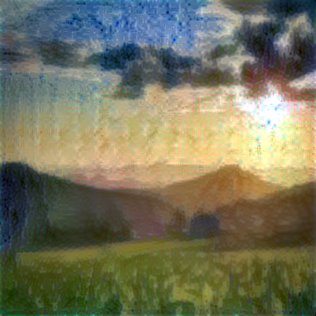

# Neural_Style_Transfer
In this repo. I have some basics of Neural Style Transfer and its applications. Neural style transfer is achived by generating an image with the same "content" as the base image, but with the "style" of a different picture (typically artistic). Here images(normal photographs/images) are styled in an artistic(Monet) manner. 

For example, here the original image of the scenary is transfer styled to a Monet styled painting. 

***Original photo***

***Styled Image***

